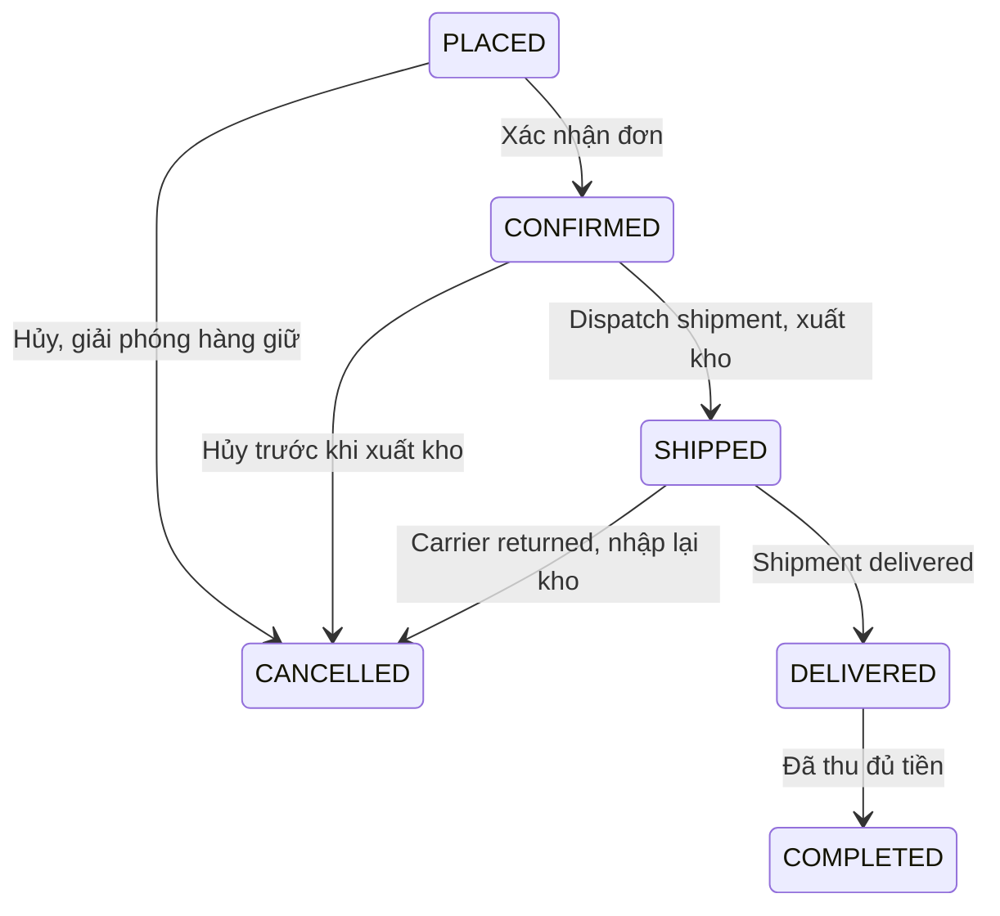

# Backend quản lý kho hàng và đơn hàng

Flyway V7 bổ sung các trường phục vụ quản lý kho/đơn trên schema V1, giữ nguyên dữ liệu hiện có. API nằm tại `/api/v1/admin`, dùng JWT và role ADMIN. V7 cấp các quyền đọc/ghi bên dưới cho role ADMIN; quyền được kiểm tra từ database ở mỗi request.

| Mục quản lý | Endpoint | Quyền |
| --- | --- | --- |
| Khai báo kho | `/warehouses`, `/warehouses/{id}` | INVENTORY_READ / INVENTORY_WRITE |
| Tồn kho | `/inventory`, `/inventory/{id}`, `/inventory/{id}/adjustments` | INVENTORY_READ / INVENTORY_WRITE |
| Nhập/xuất kho | `/inventory/transactions`, `/inventory/transactions/{id}` | INVENTORY_READ / INVENTORY_WRITE |
| Lịch sử điều chỉnh tồn kho | `/inventory/history` | INVENTORY_READ |
| Đơn hàng | `/orders`, `/orders/{id}`, `/orders/{id}/status`, `/orders/{id}/history` | ORDER_READ / ORDER_WRITE |
| Thanh toán | `/payments`, `/payments/{id}`, `/payments/{id}/status`, `/payments/{id}/transactions`, `/payments/methods` | PAYMENT_READ / PAYMENT_WRITE |
| Giao hàng | `/shipments`, `/shipments/{id}`, `/shipments/{id}/status` | SHIPMENT_READ / SHIPMENT_WRITE |
| Lịch sử giao hàng | `/shipments/history`, `/shipments/{id}/history` | SHIPMENT_READ |
| Đổi/trả hàng | `/returns`, `/returns/{id}`, `/returns/{id}/status` | RETURN_READ / RETURN_WRITE |
| Hoàn tiền | `/refunds`, `/refunds/{id}`, `/refunds/{id}/status` | REFUND_READ / REFUND_WRITE |

GET yêu cầu quyền đọc; POST/PUT/DELETE yêu cầu quyền ghi. Response dùng `ApiResponse<T>`; POST trả 201, GET/PUT/DELETE trả 200, DELETE kho trả `data: null`. Đơn hàng, tồn kho, giao dịch tiền và lịch sử là dữ liệu bền vững: hủy bằng trạng thái, không có API xóa các bản ghi này. Lịch sử chỉ được đọc và được backend ghi khi nghiệp vụ thay đổi.

Các API ghi nhận thanh toán, giao hàng và hoàn tiền do admin xác nhận; chưa gọi cổng thanh toán, ngân hàng hay API hãng vận chuyển. Hai phương thức thủ công `COD`, `BANK_TRANSFER` được seed nếu chưa tồn tại. Danh mục phương thức đang bật lấy từ GET `/payments/methods`.

## Danh sách và tìm kiếm

Mọi danh sách nhận `page` từ 0, `size` 1–50 (mặc định 20); response có `content`, `page`, `size`, `totalElements`, `totalPages`. Sắp xếp thời gian tạo giảm dần rồi UUID; tồn kho sắp xếp thời gian cập nhật giảm dần rồi UUID.

| Endpoint danh sách | Bộ lọc |
| --- | --- |
| `/warehouses` | `search` theo tên/địa chỉ, `status` ACTIVE/INACTIVE |
| `/inventory` | `search` theo SKU/tên sản phẩm, `warehouseId`, `productVariantId`, `lowStock=true` (khả dụng ≤ 5) |
| `/inventory/transactions` | `warehouseId`, `productVariantId`, `transactionType`, `referenceId`, `from`, `to` |
| `/inventory/history` | `warehouseId`, `productVariantId`, `from`, `to`; chỉ trả ADJUSTMENT |
| `/orders` | `search` theo mã đơn/người nhận/điện thoại, `status`, `paymentStatus`, `shippingStatus`, `customerId`, `from`, `to` |
| `/payments` | `orderId`, `status`, `from`, `to` |
| `/shipments` | `search` theo hãng/mã vận đơn, `orderId`, `status`, `from`, `to` |
| `/shipments/history` | `shipmentId`, `status`, `from`, `to` |
| `/returns` | `orderId`, `customerId`, `requestType`, `status`, `from`, `to` |
| `/refunds` | `paymentId`, `returnRequestId`, `status`, `from`, `to` |

`search` tối đa 254 ký tự, tìm chuỗi con không phân biệt hoa/thường, `%`, `_`, `\` là ký tự thường. `from`/`to` là ISO-8601 có múi giờ, ví dụ `2026-10-01T00:00:00Z`; khoảng thời gian bao gồm `from`, không bao gồm `to`; `to` phải sau `from`. Các timestamp trong response là UTC. Lịch sử đơn/thanh toán/giao hàng theo từng ID cũng phân trang.

## Kho và tồn kho

POST/PUT `/warehouses` hoặc `/warehouses/{id}` nhận `name`, `address`, `status`. Kho có hàng giữ không thể chuyển INACTIVE; kho đã có dòng tồn kho không thể xóa, kể cả số lượng bằng 0. Có thể xóa mềm kho chưa dùng.

POST `/inventory` nhận `warehouseId`, `productVariantId`, tạo số lượng ban đầu bằng 0. Mỗi kho/biến thể có một dòng duy nhất. Có thể nhập kho cho sản phẩm nháp/ẩn chưa xóa; chỉ biến thể/sản phẩm ACTIVE và màu/size ACTIVE được đặt bán. Response có `warehouseName`, SKU/tên sản phẩm, `quantityOnHand`, `quantityReserved`, `quantityAvailable = quantityOnHand - quantityReserved`.

POST `/inventory/transactions`:

```json
{
  "warehouseId": "<UUID kho>",
  "productVariantId": "<UUID biến thể>",
  "transactionType": "RECEIPT",
  "quantity": 20,
  "note": "Nhập hàng từ nhà cung cấp"
}
```

Manual `transactionType` chỉ nhận RECEIPT hoặc ISSUE, `quantity` dương. ISSUE trừ hàng khả dụng; không được lấy hàng đang giữ cho đơn. POST `/inventory/{id}/adjustments` nhận `quantityOnHand` và `reason`, ghi số đếm thực tế và một sự kiện ADJUSTMENT; không được giảm xuống dưới số lượng đang giữ hoặc gửi số lượng không thay đổi.

Số lượng tồn/giữ tối đa 1 tỷ. Nhật ký có số tăng/giảm, số tồn và số giữ trước/sau, người thao tác, lý do, loại/ID tham chiếu. RESERVE/RELEASE thay số giữ; SHIPMENT xuất cả tồn/giữ; RETURN nhập hàng trả; EXCHANGE xuất biến thể thay thế. Các loại này chỉ do nghiệp vụ đơn hàng sinh ra. `referenceType` là MANUAL, ORDER hoặc RETURN.

## Tạo, sửa và hủy đơn

POST `/orders`:

```json
{
  "customerId": "<UUID khách hàng ACTIVE>",
  "warehouseId": "<UUID kho ACTIVE>",
  "recipientName": "Nguyễn An",
  "recipientPhone": "0901234567",
  "shippingAddress": "123 Nguyễn Trãi, TP. Hồ Chí Minh",
  "note": "Giao giờ hành chính",
  "discountAmount": 10000,
  "shippingFee": 20000,
  "items": [{"productVariantId": "<UUID biến thể>", "quantity": 2, "discountAmount": 5000}]
}
```

Một đơn dùng một kho, 1–100 dòng biến thể không trùng, mỗi dòng 1–1 triệu đơn vị. Backend lấy giá từ biến thể đang bán và lưu snapshot tên sản phẩm/SKU/màu/size/giá. `discountAmount` của request đơn là giảm thêm trên toàn đơn; response đơn cộng cả giảm theo dòng. `subtotal` là tổng giá gốc; `totalAmount = subtotal - discountAmount + shippingFee`. Tiền không âm, tối đa 16 chữ số phần nguyên, 2 chữ số thập phân; giảm giá không được vượt giá trị hàng.

Tạo đơn sinh mã `LX-…`, trạng thái PLACED và giữ hàng ngay. Nếu bất kỳ dòng nào thiếu hàng, toàn bộ đơn, dòng hàng và nhật ký rollback. Đơn/tồn kho lịch sử vẫn đọc được sau khi sản phẩm bị xóa mềm. Đơn có total bằng 0 được xem đã thanh toán.

PUT `/orders/{id}` nhận `recipientName`, `recipientPhone`, `shippingAddress`, `note`; chỉ sửa trước khi xuất kho. Giá, khách hàng, kho và dòng hàng giữ nguyên. PUT `/orders/{id}/status` nhận `status`, `note`:



Chuyển SHIPPED/DELIVERED qua API shipment, không đặt trực tiếp qua API đơn. Hủy trước dispatch trả hàng giữ, void mọi payment PENDING và hủy shipment PENDING. Tiền đã PAID vẫn giữ trong lịch sử; khi hãng trả hàng, tạo yêu cầu trả và hoàn tiền theo luồng bên dưới. Hoàn tất đơn yêu cầu đã giao và thu đủ tiền sau hoàn. GET `/orders/{id}/history` trả người thao tác, trạng thái trước/sau và ghi chú.

## Thanh toán

POST `/payments` nhận `orderId`, `paymentMethod`, `amount` dương, tạo PENDING. Tổng PAID và PENDING không được vượt total đơn. Đơn hủy không nhận thanh toán mới. Có thể chia nhiều payment; FAILED/VOID giải phóng phần tiền đang chờ để tạo payment khác.

PUT `/payments/{id}/status` nhận `status`, `providerTransactionId` tùy chọn: PENDING → PAID / FAILED / VOID. PAID có `paidAt`; không chuyển payment đã thu về VOID, dùng refund để ghi hoàn tiền. Mã giao dịch ngân hàng/hóa đơn khi cung cấp phải duy nhất trong provider MANUAL; nếu bị trùng, toàn bộ cập nhật rollback. GET `/payments/{id}/transactions` trả sự kiện bất biến.

Trạng thái tổng trên đơn: UNPAID, PARTIALLY_PAID, PAID, PARTIALLY_REFUNDED, REFUNDED. Response đơn có `paidAmount`, `refundedAmount`. Tổng tiền thu và hoàn được tính từ các payment/refund đã hoàn thành.

## Giao hàng và lịch sử

POST `/shipments` nhận `orderId`, `shippingProvider`, `trackingCode` tùy chọn, `shippingFee`; đơn phải CONFIRMED, mỗi đơn có một shipment chưa hủy. Shipment vận chuyển toàn bộ đơn. `shippingFee` ở shipment là chi phí vận chuyển thực tế, không thay phí đã tính cho khách trên đơn. PUT `/shipments/{id}` nhận hãng/mã vận đơn, chỉ cho phép khi PENDING. Cặp hãng/mã vận đơn duy nhất nếu mã không null.

PUT `/shipments/{id}/status` nhận `status`, `description`:

- PENDING → SHIPPED hoặc CANCELLED.
- SHIPPED/IN_TRANSIT → IN_TRANSIT, DELIVERED, FAILED hoặc RETURNED.
- FAILED → IN_TRANSIT, DELIVERED hoặc RETURNED.
- DELIVERED/CANCELLED/RETURNED là trạng thái cuối.

SHIPPED xuất hàng đang giữ; retry từ FAILED không xuất thêm. DELIVERED đặt thời điểm giao và cập nhật đơn. RETURNED dùng khi hàng giao thất bại đã thực sự nhận về kho: nhập lại một lần và hủy đơn. Hủy shipment PENDING giữ reservation của đơn để tạo shipment khác hoặc hủy đơn.

Mỗi chuyển trạng thái ghi `shipment_status_history`. GET `/shipments/history` phục vụ màn lịch sử giao hàng; GET `/shipments/{id}/history` xem một shipment. Lịch sử không có API thêm/sửa/xóa thủ công.

## Đổi/trả và hoàn tiền

POST `/returns` nhận `orderId`, `requestType` RETURN/EXCHANGE, `reason`, `note` tùy chọn, `images` (0–10 URL HTTP/HTTPS), `items` gồm `orderItemId`, `quantity`, `reason`, `conditionNote`, `replacementVariantId` tùy chọn.

Chỉ cho yêu cầu khi đơn DELIVERED/COMPLETED hoặc hàng giao thất bại đã RETURNED. Khách hàng được lấy từ đơn. Mọi dòng phải thuộc đơn; tổng số lượng trong các yêu cầu chưa REJECTED/CANCELLED không được vượt số đã mua.

PUT `/returns/{id}/status` nhận `status`, `note`: REQUESTED → APPROVED / REJECTED / CANCELLED; APPROVED → COMPLETED / CANCELLED. COMPLETED xác nhận hàng đã nhận, nhập lại số lượng trả. Hàng đã được hãng vận chuyển nhập lại không nhập thêm lần nữa.

EXCHANGE yêu cầu biến thể thay thế cùng sản phẩm, giá hiện tại bằng unit price đã mua; kiểm tra lại khi duyệt. APPROVED giữ hàng thay thế tại kho gốc; COMPLETED nhập hàng gốc và xuất hàng thay thế. Hủy yêu cầu đã duyệt giải phóng reservation thay thế. Đổi chênh giá cần đơn mới; EXCHANGE không tạo refund.

RETURN có `refundableAmount`: giá trị hàng trả sau phân bổ giảm giá dòng/toàn đơn, làm tròn xuống 2 số thập phân, không bao gồm phí giao hàng. POST `/refunds` nhận `returnRequestId`, `paymentId`, `amount` dương, `refundMethod`, `reason`. Yêu cầu trả phải COMPLETED, payment phải PAID và thuộc cùng đơn. Tổng refund PENDING/SUCCEEDED không được vượt số đã thu trên payment hoặc giá trị hàng trả của yêu cầu.

PUT `/refunds/{id}/status` nhận `status`: PENDING → SUCCEEDED / FAILED / CANCELLED; ghi người xử lý và thời gian. SUCCEEDED cập nhật tổng hoàn trên đơn. FAILED/CANCELLED giải phóng hạn mức để tạo refund khác; không sửa/xóa refund đã thành công.

## Đồng thời, lỗi và kiểm thử

Các thao tác ghi kho/đơn/tiền dùng transaction và khóa PostgreSQL theo thứ tự catalog → commerce. Kiểm tra hạn mức và cập nhật cùng transaction, hoạt động qua nhiều instance server; khóa tự giải phóng khi commit/rollback. Request đọc chạy đồng thời. Ghi commerce và catalog được tuần tự hóa trong phạm vi quản trị này.

Gửi lại trạng thái hiện tại trả dữ liệu hiện có, không ghi thêm lịch sử hoặc xuất/nhập/hoàn lần nữa. POST tạo mới sinh ID mới; client cần giữ ID để retry cập nhật trạng thái của bản ghi đã tạo.

400: validation, enum/UUID sai, giảm giá không hợp lệ, khoảng thời gian sai, dòng trả/payment không cùng đơn. 401: thiếu JWT; 403: thiếu role/quyền; 404: không tồn tại/không khả dụng. 409: thiếu tồn, kho có reservation, chuyển trạng thái sai, trùng vận đơn/giao dịch tiền, trả quá số mua, payment/refund vượt hạn mức. Error code cụ thể được trả trong `code`.

```powershell
.\mvnw.cmd clean verify
```

`InventoryOrderIntegrationTests` chạy trên PostgreSQL riêng, kiểm tra kho/ledger, hủy/giữ/xuất/nhập, snapshot, thanh toán từng phần, đổi/trả, hoàn tiền, validation, phân quyền, rollback và cạnh tranh đặt đơn/hoàn tiền. ArchUnit kiểm tra feature/MVC, Hibernate validate schema V1–V8. OpenAPI và route thực tế được đối chiếu trong kiểm thử auth.

Xem [OpenAPI](openapi.json) và [request HTTP mẫu](api.http). Khi thay đổi commerce DTO/controller, chạy `python scripts/update_commerce_openapi.py` để cập nhật phần contract này.

## Ưu đãi trên đơn

Tạo đơn có thêm `couponCode` và `applyMarketing` tùy chọn. Xem [khách hàng và Marketing](customer-marketing.md) cho thứ tự tính giảm, hạn mức Flash Sale/coupon và quy tắc hoàn lượt khi hủy đơn. Bỏ các trường mới giữ API giảm thủ công hiện có.
